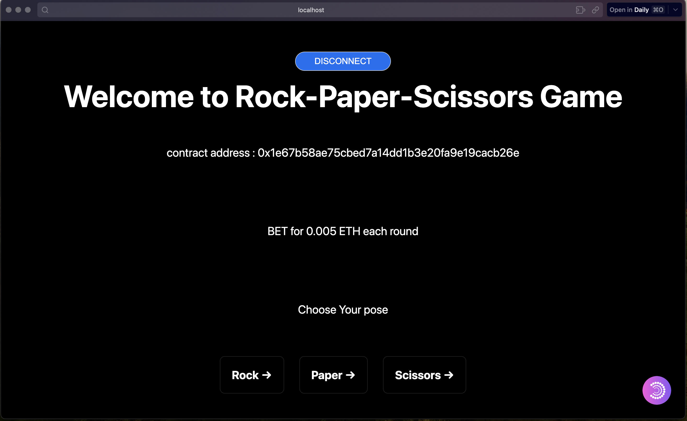

# RPS_GAME
## Frontend 
run on local
1. cd frontend
2. npm install
3. npm run dev

[HandOn Video](https://drive.google.com/file/d/1t87R7Jo-_CIGCtfBN_xBZPyc9OUG-JzH/view?usp=sharing)

## Contract
using Hardhat to compile and test
* [ Contract Document link ](https://hackmd.io/@lfTXIdCPS6yUZUounHiCmQ/B1hajXf7C)
* [ Contract Sepolia link](https://sepolia.etherscan.io/address/0x1e67b58ae75cbed7a14dd1b3e20fa9e19cacb26e)
